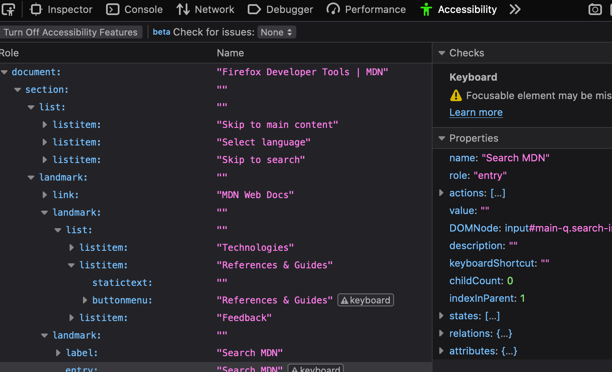
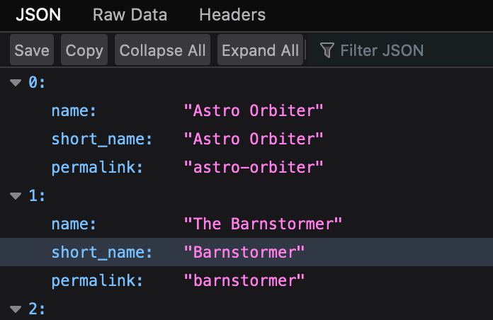
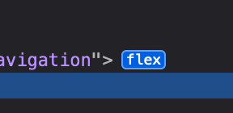
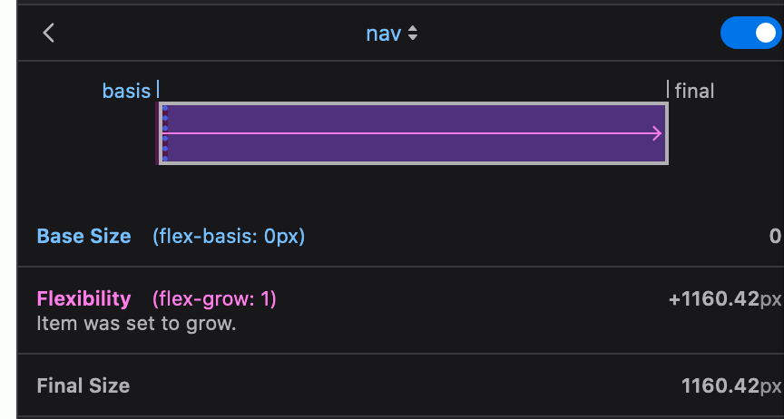
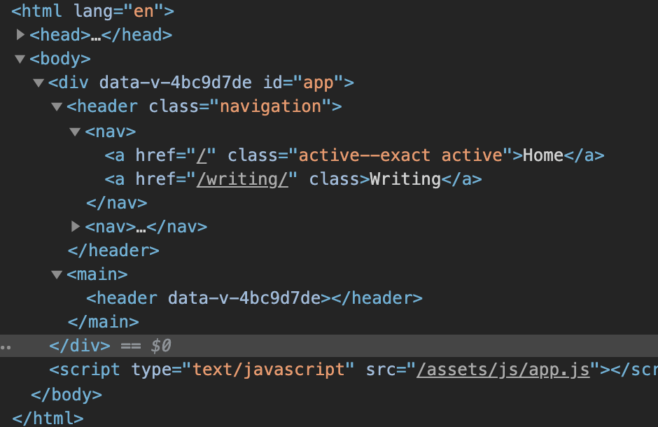
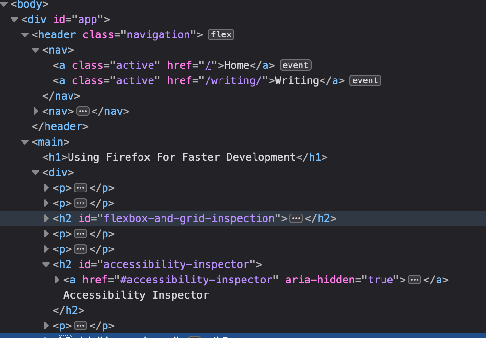
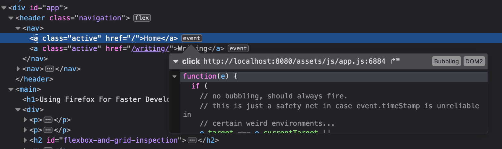

Whenever one of the browsers has a really good feature it's not too long until the rest co-opt it and we're all the better for it. There's a number of new(ish) features in Firefox that I've taken a strong liking to and I won't be surprised if they make their way over to Chrome one of these days.

I won't lie, I think that JS debugging is much easier in Chrome. When I'm working with TypeScript I find Chrome's source mapping works better, more reliably and faster. When I have to navigate the source directory to add a breakpoint to some file, Chrome does a better job of constructing a sensible structure. But these things that Chrome excels in like performance profiling, inspecting network traffic and JS debugging aren't what I find myself doing all day. When you work inside frameworks, performance is a question of correct structure and optimizing how data is shared. And network traffic is a very small portion of the broader scope of what the frontend needs to do.

I still use Firefox because it beats Chrome in all the things I need to regularly. That may sound silly as it seems all of front-end development today is about JS but we have layers on layers of tools for that already. The JS tooling is sufficient, what can pose a challenge is the lack of tooling for everything else. That's where Firefox really shines.

## Accessibility Inspector

*Accessibility tree inspector, a companion to the page inspector*

The accessibility panel was fully un-veiled about this time last year. It's matured quite a bit since then, especially in performance. It used to get bogged down very easily but it's become quite usable. I used to run it all the time to check what kinds of issues I might be able to fix but I quickly found that it just wasn't hard to head them off! Using native solutions often provides accessibility for free. Now, I mostly check in on this panel when I need to make sure that sub-optimal workarounds like extra wrapping html or pseudo-elements aren't costing us.

## JSON Viewer

One of my favorite little Firefox "bonuses" is the JSON viewer found when accessing a JSON API. It's not much more than a prettified syntax highlighted version but I find that's plenty! When I'm looking for a specific property there's the search at the top and a convenient "copy" button for when I want to use my favorite JSON to TS interface [VS Code extension](https://github.com/MariusAlch/vscode-json-to-ts).

*Accessing a JSON API directly makes it easy to identify its struture*
 (Note, the JSON viewer is only enabled by default on Developer Edition)

## Flexbox and Grid Inspection

When you're confused layout there's nothing like a visual to get you out of that hole. I *love* the flexbox inspector. It does a fantastic job of explaining how an element ending up getting the size it did. Here's where it started, here's how much extra space it was given, here's where it ended up. Click the flex button in the html inspector and you'll see the flex children in the page highlighted.

*Button to trigger the flex inspector*

Click one of the children and look at their layout panel to find how the browser is divvying up that space. So many times I've gone here to slap my head, say "DOH" and go back to apply that `flex-grow` property.

*Flexbox calculations that lead to the final size*

## Syntax highlighting

Not quite a feature like the rest but I appreciate the HTML highlighting in Firefox. I find that it does a better job of differentiating between the different kinds of information. Overall it's just easier to read and scan. Definitely a matter of personal taste though.

*Chrome inspector*

Notice how attributes, their values and text nodes have almost the same color in Chrome but very different ones in Firefox.

*Firefox inspector*

## Finding DOM Event Listeners

Last but not least, I find myself stepping through the event handlers on my UI from time to time and the easier way is definitely through the DOM event buttons. You can view a snippet of the handler or even click through to the file itself.

*A click event handler shown in the HTML panel*

