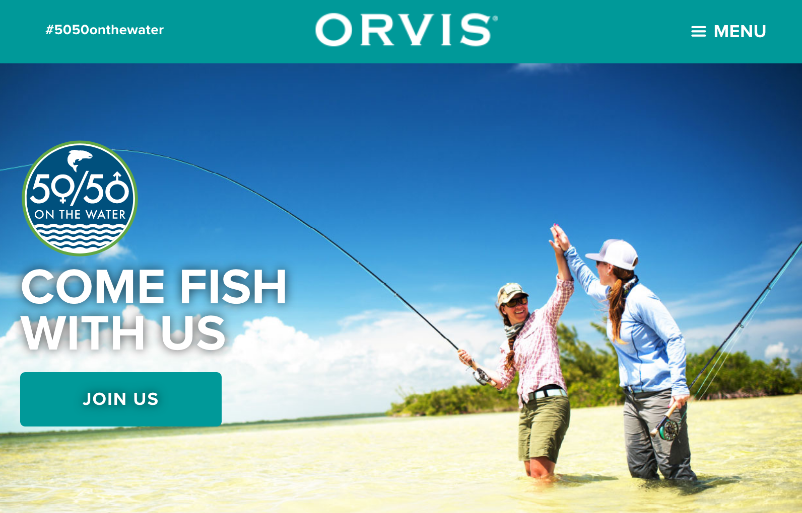
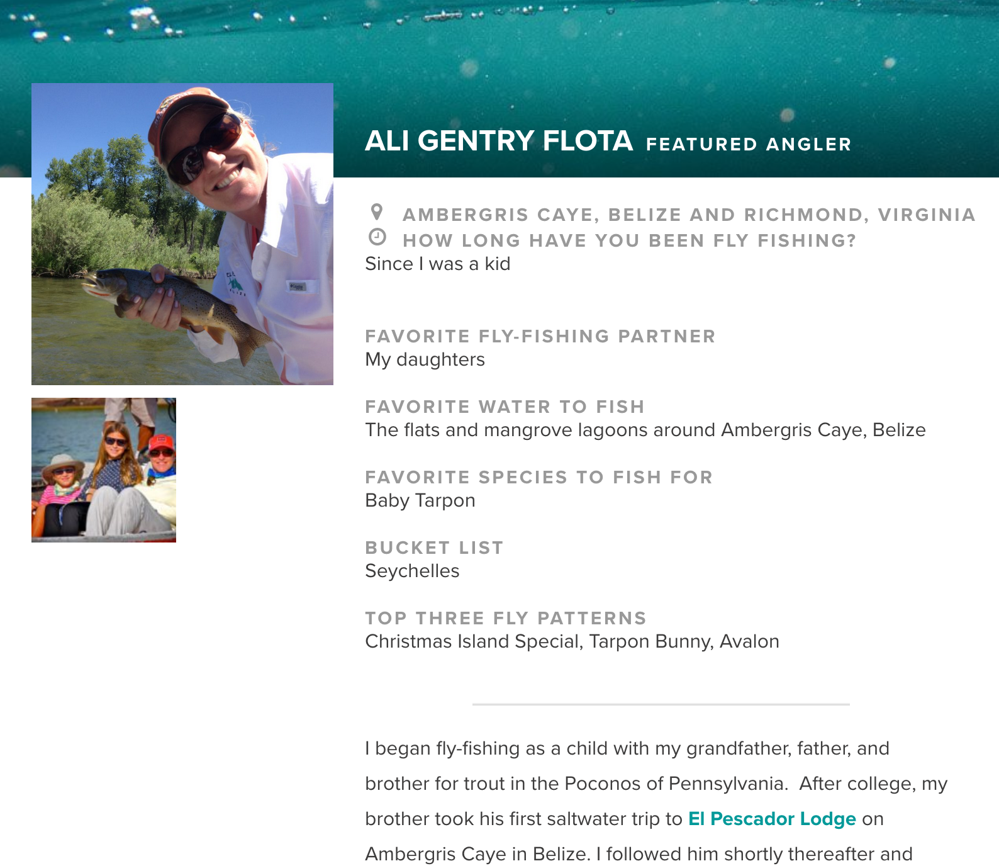

## What

A Wordpress site for Orvis to promote the inclusivity program by the same name. Featuring videos and profiles of the inspiring women in the field as well as resources and event information to get involved. Fully responsive, accessible and SEO optimized, this microsite was built to fulfill needs and remain stable through the replatforming process of the main site.

## Why

While I was already familiar with how to implement this kind of content on the main site, the solution architect choose developing against Wordpress to shortcut past the development of styles and functionality from scratch. This worked very well for the functionalities like the map widget which would not have been possible to develop otherwise within the timeline.

## How

Using the foundation of the [Shapely theme](https://wordpress.org/themes/shapely/), this site was extended with plugins for some key features like dynamic filtering content grids, event sign-up, mobile optimized menus and lazy loading for the various images and video. Even after all those changes it was required to make some custom changes by layering on additional PHP and CSS.

For easier construction I extended the theme using SCSS by pulling all their CSS into a local project. Using linting and extensions it was easy to see what styles would be easiest to build around and avoid collisions. 

## What I learned

Were I to do a project like this again I think it would have been faster and easier to utilize a skeleton theme and skeleton styles for plugins rather than spending so much time researching how to work around what was already there. This project taught me to work to my competencies.
